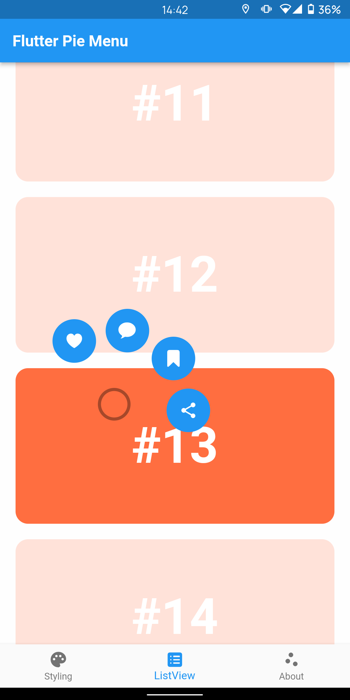

<!--
This README describes the package. If you publish this package to pub.dev,
this README's contents appear on the landing page for your package.

For information about how to write a good package README, see the guide for
[writing package pages](https://dart.dev/guides/libraries/writing-package-pages).

For general information about developing packages, see the Dart guide for
[creating packages](https://dart.dev/guides/libraries/create-library-packages)
and the Flutter guide for
[developing packages and plugins](https://flutter.dev/developing-packages).
-->

# Flutter Pie Menu 🥧

A Flutter library that provides a circular context menu similar to Pinterest's.

|Screenshot|Easily Customizable|Works with Scrollables|
|:-:|:-:|:-:|
||||

## Usage

Wrap the widget that will react to gestures with `PieMenu` widget, and give the menu a list of `PieAction`s to display as menu buttons.

```dart
PieMenu(
  actions [
    PieAction(
      tooltip: 'Like',
      iconData: Icons.favorite,
      onSelect: () => print('Like action selected.'),
    ),
  ],
  child: YourWidget(),
),
```

Note that you can only use `PieMenu` in the sub-hierarchy of a `PieCanvas` widget. Wrap the parent widget of your page (or any other widget you want to draw the canvas on) with `PieCanvas` widget.

For example, if you want the menu to be displayed at the forefront, you can wrap your `Scaffold` with a `PieCanvas` like following:

```dart
PieCanvas(
  child: Scaffold(
    body: YourScaffoldBody(
      ...
        PieMenu(),
      ...
    ),
  ),
),
```

## Using with Scrollable and Interactive Widgets

> ⚠️ If you want to use `PieMenu` inside a scrollable view like a `ListView`, or your widget is already interactive (e.g. it is clickable), you may need to **pay attention to this section.**

`PieCanvas` has a functional callback named `onMenuToggle` which is triggered when a `PieMenu` that inherits the respective canvas is opened and closed. Using this callback, you can prevent your scrollable or interactive widget's default behavior in order to give the control to the `PieMenu`.

If you can think of a better implementation to handle this automatically, feel free to create a new issue on this package's repository and express your opinion.

Using the `menuVisible` parameter of the `onMenuToggle` callback, store a `bool` variable in your `StatefulWidget` state.

```dart
bool _menuVisible = false;

@override
Widget build(BuildContext context) {
  return PieCanvas(
    onMenuToggle: (menuVisible) {
      setState(() => _menuVisible = menuVisible);
    },
    ...
  );
}
```

### Scrollable Widgets

Using the `_menuVisible` variable, you can decide whether scrolling should be enabled or not.


```dart
ListView(
  // Disable scrolling if a 'PieMenu' is visible
  physics: _menuVisible
      ? NeverScrollableScrollPhysics()
      : ScrollPhysics(), // Or your own scroll physics
  ...
);
```

### Interactive Widgets

Again using the `_menuVisible` variable, you can disable the default behavior of your interactive widget. For example, if your widget detects taps using a `GestureDetector`, you can nullify the `onTap` callback when a `PieMenu` is visible.

```dart
GestureDetector(
  onTap: _menuVisible
      ? null
      : () => print('Tap'),
```

## Customization

You can customize the appearance and behavior of menus using `PieTheme`.

Using the `theme` attribute of `PieCanvas` widget, you can specify a theme for all the `PieMenu`s that inherit it.

```dart
PieCanvas(
  theme: PieTheme(),
  ...
    PieMenu(), // Uses the canvas theme
  ...
    PieMenu(), // Uses the canvas theme
  ...
),
```

But if you want to specify menu specific themes, you can also use the `theme` attribute of `PieMenu` widget.

```dart
PieMenu(
  theme: PieTheme(), // Overrides the canvas theme
),
```

Buttons' background and icon colors are defined by theme's `buttonTheme` and `hoveredButtonTheme` properties. You can create a custom `PieButtonTheme` instances for your theme.

```dart
PieTheme(
  buttonTheme: PieButtonTheme(),

  // Using 'hovered' constructor is not necessary
  hoveredButtonTheme: PieButtonTheme.hovered(),
),
```

If you want to use a custom widget instead of an icon for the action button, you can use the `customWidget` and `customHoveredWidget` properties of the respective `PieAction`.
